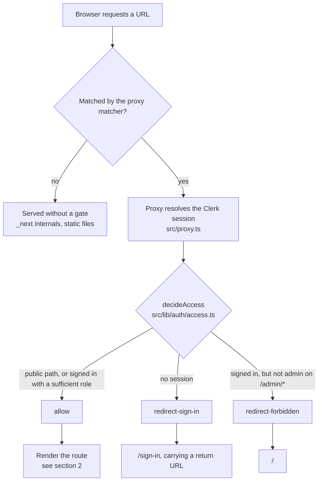
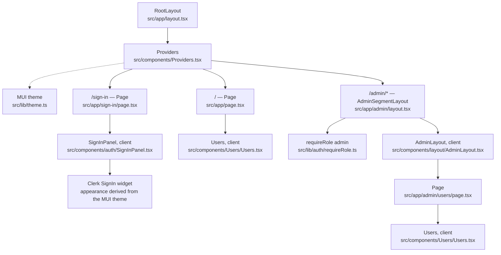
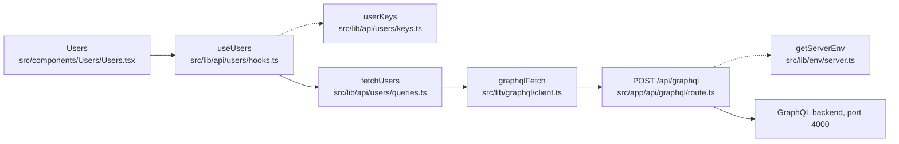

# Auth and component flow

How a request becomes a screen in this frontend: what runs, what the user sees,
and which file to open. Every visitor passes the same gate before any component
renders.

Paths are relative to `frontend/`.

---

## 1. The gate

Runs on every matched request, before any rendering.



Two things are deliberate here:

- **`src/proxy.ts` holds no rules.** It resolves the session and translates a
  decision into a response. All policy lives in `src/lib/auth/access.ts` as a
  pure function, which is why it can be tested without Next or Clerk in the way.
- **An unauthenticated request to `/admin/*` goes to sign-in, not to forbidden.**
  A signed-out visitor shouldn't learn that an admin route exists.

Next.js 16 renamed middleware to *proxy*; `src/proxy.ts` is the former
`middleware.ts`.

---

## 2. The render tree

`RootLayout` and `Providers` wrap every route. Providers nest outside-in: Clerk,
the MUI/Emotion cache for the App Router, TanStack Query, then the MUI theme and
`CssBaseline`.



### Routes at a glance

| Route | Access | What renders | Entry file |
| --- | --- | --- | --- |
| `/sign-in` | Public — the only route reachable without a session | Clerk's widget centred in the viewport, restyled to the MUI theme | `src/app/sign-in/page.tsx` |
| `/` | Any signed-in user; the role claim is not consulted | Bare `<h1>Users</h1>` and the user list, with no app chrome | `src/app/page.tsx` |
| `/admin/users` | `admin` only, checked at the proxy *and* in the layout | MUI AppBar and collapsible Drawer around the user list | `src/app/admin/users/page.tsx` |

`/sign-in` is prerendered as static; `/admin/users` renders dynamically because
its layout calls `auth()`.

---

## 3. The data path behind the user list

`/` and `/admin/users` render the same `Users` component, so both follow this
chain. The browser never talks to the GraphQL backend directly — it goes through
an internal route handler.



| Step | File | What it does |
| --- | --- | --- |
| `useUsers` | `src/lib/api/users/hooks.ts` | TanStack Query hook; caches under the shared key factory |
| `userKeys` | `src/lib/api/users/keys.ts` | Cache keys — `["users"]` and `["users", id]` |
| `fetchUsers` | `src/lib/api/users/queries.ts` | Holds the GraphQL documents; types responses from the generated contract package |
| `graphqlFetch` | `src/lib/graphql/client.ts` | POSTs to `/api/graphql`, unwraps errors and the data envelope |
| Route handler | `src/app/api/graphql/route.ts` | Server-side forwarder to the real GraphQL server |
| `getServerEnv` | `src/lib/env/server.ts` | Zod-validates `GRAPHQL_SERVER` before forwarding |

---

## 4. Auth module index

| Module | File | Runs on | Responsibility |
| --- | --- | --- | --- |
| proxy | `src/proxy.ts` | Every matched request | Edge adapter — turns a decision into a response. No rules of its own. |
| `decideAccess` | `src/lib/auth/access.ts` | Every matched request | The entire policy, as a pure function. Also owns public and admin path matching. |
| roles | `src/lib/auth/roles.ts` | Policy and guards | Role vocabulary and safe claim parsing; unrecognised values resolve to no role. |
| `requireRole` | `src/lib/auth/requireRole.ts` | `/admin/*` layout | Resource-level guard for server components, so the segment stays protected if the matcher changes. |
| Session claim types | `src/types/globals.d.ts` | Compile time | Declares the token's `metadata.role` shape — optional, because it is genuinely absent until configured. |

Tests sit beside each module: `access.test.ts`, `roles.test.ts`,
`requireRole.test.ts`, `src/proxy.test.ts`, and
`src/components/auth/SignInPanel.test.tsx`. Run them with `pnpm test`.

---

## 5. Worth knowing before you edit

**Required Clerk Dashboard setup.** The role only reaches the proxy if Clerk
copies it into the session token. Add this session claim in the Dashboard:

```json
{ "metadata": "{{user.public_metadata}}" }
```

Without it, every role lookup returns nothing and `/admin/*` denies everyone,
including real admins. See [`auth.md`](./auth.md) for assigning roles.

**Where to add a rule.** New public route, new protected prefix, new role: edit
`src/lib/auth/access.ts`. The proxy and the layout guards both read from it, so
one edit covers the edge and the resource.

**The backend is still open.** These gates protect pages and the internal API
route only. The GraphQL server has no token verification and remains directly
reachable on port 4000, so a signed-out client can still query it. Tracked as
the next task, not fixed here.

**No sign-up route.** Nothing serves `/sign-up`, so the widget's sign-up link
bounces back to sign-in. Create accounts from the Clerk Dashboard for now.

**`/users` has moved.** It was previously served by an `(admin)` route group,
whose parentheses added no URL segment. It is now genuinely `/admin/users`.

**Defined but never imported.** Three files are unreferenced — left in place, but
don't assume they're wired in:

- `src/components/Users/UserDetail.tsx`
- `src/lib/providers/QueryProvider.tsx` — `Providers.tsx` has its own `QueryClientProvider`
- `src/lib/queries/orders.ts`

---

## Keeping this current

Nothing enforces that this file matches the code. Refresh it when routes,
component nesting, or the auth modules change.

It is also published as a rendered page at
<https://claude.ai/code/artifact/acc3b74a-bdf8-4f83-b12d-cc62af4b5e14>. To update
that page, republish this file with the URL above pinned as the target —
otherwise a new link is minted and the one above goes stale.
