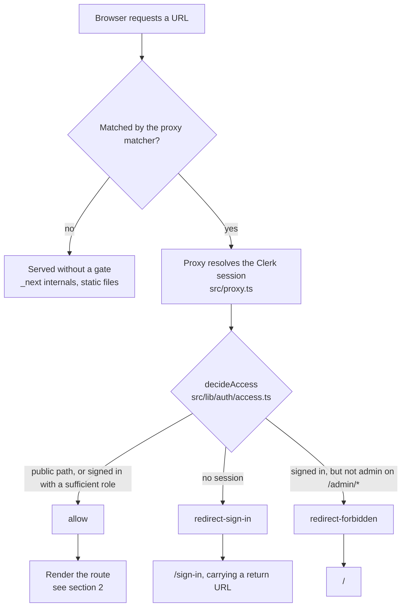
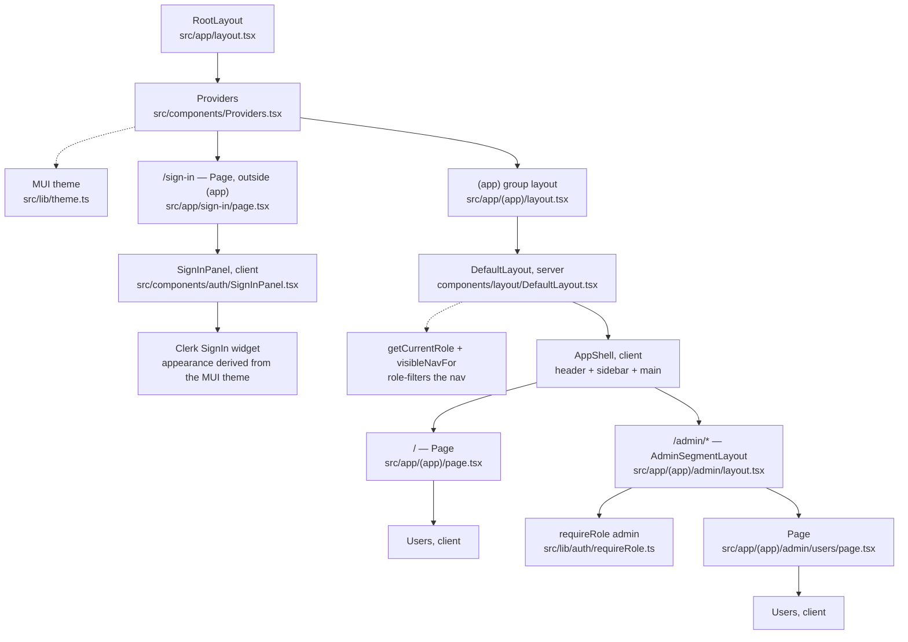
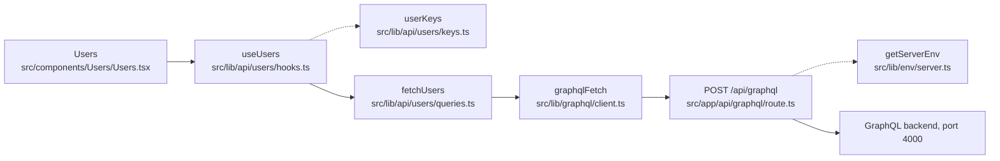

# Auth and component flow

How a request becomes a screen in this frontend: what runs, what the user sees,
and which file to open. Every visitor passes the same gate before any component
renders.

Paths are relative to `frontend/`.

---

## 1. The gate

Runs on every matched request, before any rendering.


```mermaid
flowchart TD
    REQ["Browser requests a URL"]
    MATCH{"Matched by the proxy matcher?"}
    SKIP["Served without a gate<br/>_next internals, static files"]
    PROXY["Proxy resolves the Clerk session<br/>src/proxy.ts"]
    DECIDE{"decideAccess<br/>src/lib/auth/access.ts"}
    ALLOW["allow"]
    SIGNIN["redirect-sign-in"]
    FORBID["redirect-forbidden"]
    RENDER["Render the route<br/>see section 2"]
    TOSIGNIN["/sign-in, carrying a return URL"]
    TOHOME["/"]

    REQ --> MATCH
    MATCH -->|no| SKIP
    MATCH -->|yes| PROXY
    PROXY --> DECIDE
    DECIDE -->|"public path, or signed in with a sufficient role"| ALLOW
    DECIDE -->|"no session"| SIGNIN
    DECIDE -->|"signed in, but not admin on /admin/*"| FORBID
    ALLOW --> RENDER
    SIGNIN --> TOSIGNIN
    FORBID --> TOHOME
```

Two things are deliberate here:

- **`src/proxy.ts` holds no rules.** It resolves the session and translates a
  decision into a response. All policy lives in `src/lib/auth/access.ts` as a
  pure function, which is why it can be tested without Next or Clerk in the way.
- **An unauthenticated request to `/admin/*` goes to sign-in, not to forbidden.**
  A signed-out visitor shouldn't learn that an admin route exists.

Next.js 16 renamed middleware to *proxy*; `src/proxy.ts` is the former
`middleware.ts`.

---

## 2. The render tree

`RootLayout` and `Providers` wrap every route. Providers nest outside-in: Clerk,
the MUI/Emotion cache for the App Router, TanStack Query, then the MUI theme and
`CssBaseline`.

Below that, the tree forks on **whether the route is inside the `(app)` route
group**. Inside, it gets the shared application chrome; outside, it renders bare.
`(app)` adds no URL segment — see [`layout.md`](./layout.md).


```mermaid
flowchart TD
    LAYOUT["RootLayout<br/>src/app/layout.tsx"]
    PROVIDERS["Providers<br/>src/components/Providers.tsx"]
    THEME["MUI theme<br/>src/lib/theme.ts"]

    SIGNINPAGE["/sign-in — Page, outside (app)<br/>src/app/sign-in/page.tsx"]
    PANEL["SignInPanel, client<br/>src/components/auth/SignInPanel.tsx"]
    WIDGET["Clerk SignIn widget<br/>appearance derived from the MUI theme"]

    GROUP["(app) group layout<br/>src/app/(app)/layout.tsx"]
    DEFAULT["DefaultLayout, server<br/>components/layout/DefaultLayout.tsx"]
    ROLE["getCurrentRole + visibleNavFor<br/>role-filters the nav"]
    SHELL["AppShell, client<br/>header + sidebar + main"]

    HOMEPAGE["/ — Page<br/>src/app/(app)/page.tsx"]
    USERS1["Users, client"]

    ADMINGUARD["/admin/* — AdminSegmentLayout<br/>src/app/(app)/admin/layout.tsx"]
    GUARD["requireRole admin<br/>src/lib/auth/requireRole.ts"]
    ADMINPAGE["Page<br/>src/app/(app)/admin/users/page.tsx"]
    USERS2["Users, client"]

    LAYOUT --> PROVIDERS
    PROVIDERS -.-> THEME
    PROVIDERS --> SIGNINPAGE
    PROVIDERS --> GROUP

    SIGNINPAGE --> PANEL
    PANEL --> WIDGET

    GROUP --> DEFAULT
    DEFAULT -.-> ROLE
    DEFAULT --> SHELL
    SHELL --> HOMEPAGE
    SHELL --> ADMINGUARD

    HOMEPAGE --> USERS1

    ADMINGUARD --> GUARD
    ADMINGUARD --> ADMINPAGE
    ADMINPAGE --> USERS2
```

Note that `AdminSegmentLayout` is now **only a guard** — it calls `requireRole`
and renders its children. The chrome comes from the `(app)` group above it, so
there is no longer a separate admin layout component.

### Routes at a glance

| Route | Access | What renders | Entry file |
| --- | --- | --- | --- |
| `/sign-in` | Public — the only route reachable without a session | Clerk's widget centred in the viewport, restyled to the MUI theme. **No app chrome.** | `src/app/sign-in/page.tsx` |
| `/` | Any signed-in user; the role claim is not consulted | The user list inside the app layout | `src/app/(app)/page.tsx` |
| `/admin/users` | `admin` only, checked at the proxy *and* in the segment layout | The user list inside the app layout, with Users highlighted in the sidebar | `src/app/(app)/admin/users/page.tsx` |

`/sign-in` is prerendered as static. **Everything inside `(app)` renders
dynamically**, because the group layout calls both `auth()` and `cookies()` — so
`/` is now dynamic too, where it used to be static.

---

## 3. The data path behind the user list

`/` and `/admin/users` render the same `Users` component, so both follow this
chain. The browser never talks to the GraphQL backend directly — it goes through
an internal route handler.


```mermaid
flowchart LR
    U["Users<br/>src/components/Users/Users.tsx"]
    H["useUsers<br/>src/lib/api/users/hooks.ts"]
    K["userKeys<br/>src/lib/api/users/keys.ts"]
    Q["fetchUsers<br/>src/lib/api/users/queries.ts"]
    C["graphqlFetch<br/>src/lib/graphql/client.ts"]
    R["POST /api/graphql<br/>src/app/api/graphql/route.ts"]
    E["getServerEnv<br/>src/lib/env/server.ts"]
    B["GraphQL backend, port 4000"]

    U --> H
    H -.-> K
    H --> Q
    Q --> C
    C --> R
    R -.-> E
    R --> B
```

| Step | File | What it does |
| --- | --- | --- |
| `useUsers` | `src/lib/api/users/hooks.ts` | TanStack Query hook; caches under the shared key factory |
| `userKeys` | `src/lib/api/users/keys.ts` | Cache keys — `["users"]` and `["users", id]` |
| `fetchUsers` | `src/lib/api/users/queries.ts` | Holds the GraphQL documents; types responses from the generated contract package |
| `graphqlFetch` | `src/lib/graphql/client.ts` | POSTs to `/api/graphql`, unwraps errors and the data envelope |
| Route handler | `src/app/api/graphql/route.ts` | Server-side forwarder to the real GraphQL server |
| `getServerEnv` | `src/lib/env/server.ts` | Zod-validates `GRAPHQL_SERVER` before forwarding |

---

## 4. Auth module index

| Module | File | Runs on | Responsibility |
| --- | --- | --- | --- |
| proxy | `src/proxy.ts` | Every matched request | Edge adapter — turns a decision into a response. No rules of its own. |
| `decideAccess` | `src/lib/auth/access.ts` | Every matched request | The entire policy, as a pure function. Also owns public and admin path matching. |
| roles | `src/lib/auth/roles.ts` | Policy and guards | Role vocabulary and safe claim parsing; unrecognised values resolve to no role. |
| `requireRole` | `src/lib/auth/requireRole.ts` | `/admin/*` layout | Resource-level guard for server components, so the segment stays protected if the matcher changes. |
| `getCurrentRole` | `src/lib/auth/requireRole.ts` | `(app)` group layout | Reads the role **without** redirecting, for deciding what to display. |
| Session claim types | `src/types/globals.d.ts` | Compile time | Declares the token's `metadata.role` shape — optional, because it is genuinely absent until configured. |

### The layout also reads the role — for display only

`DefaultLayout` calls `getCurrentRole()` and filters the navigation with
`visibleNavFor(role)`. This is **presentation, not enforcement**: it hides links a
user shouldn't see, and does nothing to stop them reaching the URL directly.
Enforcement remains the proxy and `requireRole`. See
[`layout.md`](./layout.md#4-role-visibility).

Tests sit beside each module: `access.test.ts`, `roles.test.ts`,
`requireRole.test.ts`, `src/proxy.test.ts`,
`src/components/auth/SignInPanel.test.tsx`, and the layout suite under
`src/components/layout/`. Run them with `pnpm test`.

---

## 5. Worth knowing before you edit

**Required Clerk Dashboard setup.** The role only reaches the proxy if Clerk
copies it into the session token. Add this session claim in the Dashboard:

```json
{ "metadata": "{{user.public_metadata}}" }
```

Without it, every role lookup returns nothing and `/admin/*` denies everyone,
including real admins. See [`auth.md`](./auth.md) for assigning roles.

**Where to add a rule.** New public route, new protected prefix, new role: edit
`src/lib/auth/access.ts`. The proxy and the layout guards both read from it, so
one edit covers the edge and the resource.

**Adding a nav entry is a separate, non-security change.** `NAV_SECTIONS` in
`src/lib/navigation/navigation.ts` controls what is *shown*. A new admin page needs
**both** a guard and a nav entry; adding the entry alone shows a link without
protecting it, and adding the guard alone protects a page nobody can find. See
[`layout.md`](./layout.md#3-adding-a-navigation-entry).

**The backend is still open.** These gates protect pages and the internal API
route only. The GraphQL server has no token verification and remains directly
reachable on port 4000, so a signed-out client can still query it. Tracked as
the next task, not fixed here.

**No sign-up route.** Nothing serves `/sign-up`, so the widget's sign-up link
bounces back to sign-in. Create accounts from the Clerk Dashboard for now.

**Two route-group moves have happened — URLs did not change the second time.**
`/users` was once served by an `(admin)` route group whose parentheses added no URL
segment; it is now genuinely `/admin/users`. Separately, `page.tsx` and `admin/`
later moved into an `(app)` group to pick up the shared layout — that move changed
**no** URLs, because `(app)` is also a group. Confirmed against the production
route table.

**Defined but never imported.** Three files are unreferenced — left in place, but
don't assume they're wired in:

- `src/components/Users/UserDetail.tsx`
- `src/lib/providers/QueryProvider.tsx` — `Providers.tsx` has its own `QueryClientProvider`
- `src/lib/queries/orders.ts`

---

## Keeping this current

Nothing enforces that this file matches the code. Refresh it when routes,
component nesting, or the auth modules change.

It is also published as a rendered page at
<https://claude.ai/code/artifact/acc3b74a-bdf8-4f83-b12d-cc62af4b5e14>. To update
that page, republish this file with the URL above pinned as the target —
otherwise a new link is minted and the one above goes stale.
